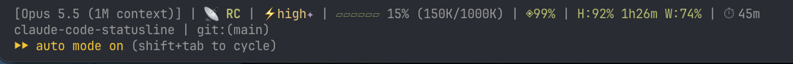
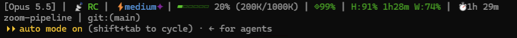

# pace-statusline

**Двухстрочная строка статуса для Claude Code: во что обходится длинная сессия — модель, уровень усилий, контекст, кеш промпта, лимиты и темп, с которым они тратятся, — и где вы находитесь в репозитории. Плюс строки для суб-агентов.**

Скрипты на bash, `bash` + `jq`, лицензия MIT. Ставится плагином Claude Code или из клона репозитория. Любой блок можно выключить, любой порог — поменять.

*English: [README.md](README.md)*

Плагин называется **pace-statusline**, репозиторий сохранил первое имя — `claude-code-statusline`. Имена плагинов на `claude-` Claude Code оставляет за плагинами самого Anthropic.

> Соседние репозитории: **[claude-code-playbook](https://github.com/tsalkin/claude-code-playbook)** — рабочие соглашения для агента · **[claude-memory-hygiene](https://github.com/tsalkin/claude-memory-hygiene)** — держит индекс памяти в бюджете.

---

## Как выглядит

Вживую, на машинах автора — macOS (Ghostty) и Windows 11 (Git Bash). Третья строка — собственная строка Claude Code.





Все блоки, с включёнными необязательными модулями:

```
[Opus 5 (1M context)] | ⚡high✦(≠xhigh) | ▰▰▰▱▱▱ 42% (420K/1000K) | ◈95% →14:32 ✗tools | H:20% 3h0m ⇡40% W:25% 2d0h | ⏱ 1h 20m
⬆ /gsd-update | v1.2 Auth rewrite · executing · session tokens (3/7) | ⚑ #12 fix login +1 /5 | ✎ Починить вход | myproject | git:(main) | PR #1234 ✓ | ⑂ feature-x
```

Без необязательных модулей (нет GSD, нет задачника) вторая строка просто такая:

```
myproject | git:(main) | ⑂ feature-x
```

А с необязательными строками суб-агентов каждый работающий агент на панели агентов Claude Code получает свою строку:

```
ispolnitel · opus-5-5 ⚡high · ▰▱▱▱ 34% 68K ▁▂▃▅▆▇██ · 3m12s · Writing tests for the pace block
mekhanik · sonnet-5 ⚡low(≠xhigh) · ▰▰▰▱ 85% 170K · 50s · Bump version
```

В терминале блоки цветные: зелёный → жёлтый → красный по мере того, как становится дорого.

### Строка 1 — модель, цена, контекст

| Блок | Источник (поле входа) | Что значит |
|---|---|---|
| `[Opus 5 (1M context)]` | `model.display_name` | Какая модель отвечает. |
| `📡 RC` | `~/.claude/sessions/*.json` (не поле входа) | Сессия сейчас доступна через Remote Control (claude.ai / телефон). См. ниже. |
| `⚡high` | `effort.level` | Текущий уровень усилий. Зелёный `low`/`auto`, голубой `medium`, жёлтый `high`, пурпурный `xhigh`/`max`. |
| `✦` | `thinking.enabled` | Включено расширенное мышление. |
| `(≠xhigh)` | `effort.level` против `effortLevel` в `settings.json` | Работа идёт **ниже** уровня, заданного глобально (например, его понизила настройка под модель). Красным. |
| `▰▰▰▱▱▱ 42% (420K/1000K)` | `context_window.*` | Занятый контекст: полоса — заполненное ▰ ярким цветом, пустое ▱ бледным (зелёная <50%, жёлтая <80%, красная ≥80%), процент, токены / размер окна. |
| `◈95%` / `◈cold 175K` | `prompt_cache.*` | Тёплый кеш и доля попаданий — или холодный кеш и сколько токенов пересоберёт следующий запрос. Это число и есть цена решения «продолжать сессию или начать заново». |
| `→14:32` | `prompt_cache.expires_at` | Когда тёплый кеш остынет: отойдёте дольше этого — следующий запрос заплатит за весь контекст заново. Время на часах, а не обратный отсчёт: пока вас нет, строка не перерисовывается. |
| `✗tools` | `prompt_cache.last_miss_cause` | Почему случился последний промах кеша — 15 минут после него: `tools` (сменился набор инструментов — подключился или отвалился MCP-сервер), `system` (сменился системный промпт), `ttl` (кеш истёк), `server`. `+1` — ещё одна причина. |
| `H:70% 2h10m` | `rate_limits.five_hour.*` | **Остаток** пятичасового лимита и время до сброса. |
| `⇡40%` | `rate_limits.*` | **Темп**: из окна израсходовано на 40 пунктов больше, чем прошло его времени, — в таком темпе лимит кончится раньше сброса. Показывается с 5 пунктов, красным. Идея из [claude-pace](https://github.com/Astro-Han/claude-pace). |
| `W:88%` / `W:25% 2d0h` | `rate_limits.seven_day.*` | Остаток недельного лимита; время до сброса — когда он уже не зелёный. |
| `⏱ 1h 20m` | возраст файла стенограммы | Сколько идёт сессия. |

**Значок удалённого управления.** Зелёный `📡 RC` сразу после модели значит, что сессия сейчас доступна через Remote Control (claude.ai или приложение на телефоне). Во входных данных строки статуса такого поля нет, поэтому скрипт ищет `session_id` этой сессии в реестре сессий Claude Code — `~/.claude/sessions/*.json` (или `$CLAUDE_CONFIG_DIR/sessions`, если эта переменная задана) — и показывает значок, если у найденной записи непустое поле `bridgeSessionId`. Это поле **не документировано**: в будущих версиях Claude Code его могут переименовать или убрать, и тогда значок просто перестанет появляться — больше ничего не сломается. Включение и выключение проверены вживую на Claude Code 2.1.278 (22.09.2026): при отключении значок гаснет, при новом подключении загорается снова. Выключить значок — `STATUSLINE_SHOW_RC=0`.

### Строка 2 — где вы

| Блок | Источник | Что значит |
|---|---|---|
| `⬆ /gsd-update`, `⚠ stale hooks` | кеш обновлений GSD | *Необязательно, только GSD.* Есть обновление или устаревшие хуки. |
| `v1.2 Auth rewrite · executing · session tokens (3/7)` | `.planning/STATE.md` | *Необязательно, только GSD.* Веха · статус · фаза. Если есть задача в работе — вместо этого она, жирным. |
| `⚑ #12 fix login +1 /5` | ваша команда (см. [Модуль задач](#модуль-задач)) | *Необязательно.* Самая срочная задача, сколько ещё срочных, всего открытых. |
| `✎ Починить вход` | `session_name` | Имя сессии — заданное через `--name` или `/rename`, иначе название, которое дал ей сам Claude Code. Помогает различать параллельные сессии. Обрезается на 32 символах. |
| `myproject` | текущий каталог | Проект. |
| `git:(main)` | `git` | Ветка. |
| `PR #1234 ✓` | `pr.*` | Открытый пулл-реквест ветки (`MR !12` в GitLab), цвет по обзору: `✓` одобрен, `✗` просят правок, `…` ждёт, `draft` черновик. В терминалах с поддержкой OSC 8 — ссылка. |
| `⑂ feature-x` | `workspace.git_worktree` | Вы в рабочей копии git worktree. |

Необязательные модули рисуются **только** если есть их файлы (GSD) или задана команда (задачи). Без них нет ни пустых блоков, ни висящих разделителей.

### Узкий терминал

Claude Code сообщает скрипту ширину терминала (`$COLUMNS`). Если строка не помещается, блоки убираются, начиная с наименее важных, пока она не влезет: в первой строке уходят время сессии, потом кеш, модель, уровень усилий, значок RC, лимиты; во второй — уведомление об обновлении GSD, worktree, состояние GSD, задачи, проект, имя сессии, PR. Полоса контекста и ветка остаются. `STATUSLINE_FIT=0` выключает подгонку.

### Строки суб-агентов

На панели агентов Claude Code у каждого работающего суб-агента своя строка. `subagent-statusline.sh` (настройка `subagentStatusLine`) заменяет её содержимое на: имя · модель ⚡уровень · полоса контекста, токены и мини-график того, как быстро агент заполняет контекст · сколько работает · чем занят.

- `⚡low(≠xhigh)` красным: агент сам выставил себе уровень **ниже** `effortLevel` из `settings.json` — та же сверка, что в основной строке.
- `⚡inh`: агент наследует уровень сессии. `⚡8K`: бюджет токенов числом.
- Строки, которые не агенты (команды оболочки, workflow), Claude Code рисует по-своему.
- У агента, запущенного инструментом Agent, в данных строки обычно нет имени; вместо него — описание задачи, обрезанное на 32 символах (`STATUSLINE_SUBAGENT_NAME_MAX`).

## Установка

### Плагином Claude Code

```
/plugin marketplace add tsalkin/claude-code-statusline
/plugin install pace-statusline@tsalkin
/pace-statusline:setup
```

Плагин не может сам включить основную строку статуса: `statusLine` Claude Code берёт только из ваших собственных настроек. Это делает команда `setup`: показывает, что изменит, спрашивает, делает резервную копию `settings.json` и записывает `statusLine` (и, если хотите, строки суб-агентов). Команды указывают на маленький запускатель в каталоге данных плагина — он при каждом запуске находит установленную версию, поэтому после обновлений плагина настраивать заново не нужно. `/pace-statusline:setup remove` убирает всё обратно.

**Ставили до 03.10.2026 как `claude-code-statusline@claude-code-statusline`?** Плагин и его маркетплейс переименованы для каталога плагинов. Удалите старый (`/plugin uninstall claude-code-statusline@claude-code-statusline`, затем `/plugin marketplace remove claude-code-statusline`), добавьте и поставьте заново командами выше и запустите `/pace-statusline:setup`: старый запускатель он узнает как свой и заменит без `--force`.

### Из клона репозитория

```bash
git clone https://github.com/tsalkin/claude-code-statusline.git ~/claude-code-statusline
~/claude-code-statusline/scripts/install.sh --subagents --dry-run   # посмотреть, что изменится
~/claude-code-statusline/scripts/install.sh --subagents
```

`install.sh` меняет только `statusLine` и `subagentStatusLine`, оставляет резервную копию (`settings.json.bak-statusline-<время>`), не заменяет чужую строку статуса без `--force`, а `--uninstall` убирает только свои записи. Или добавьте вручную в `~/.claude/settings.json`:

```json
{
  "statusLine": {
    "type": "command",
    "command": "bash ~/claude-code-statusline/statusline.sh"
  },
  "subagentStatusLine": {
    "type": "command",
    "command": "bash ~/claude-code-statusline/subagent-statusline.sh"
  }
}
```

Всё — строка перерисуется со следующим ответом.

Для простаивающей сессии (ждёт фоновых агентов, управляется удалённо) добавьте в `statusLine` `"refreshInterval": 30`: тогда Claude Code перерисовывает строку ещё и раз в 30 секунд, и отсчёты и значок RC не устаревают.

### Зависимости

| Инструмент | Для чего |
|---|---|
| `bash` (3.2+) | всё |
| `jq` | всё — без него строка печатает `jq not found` и больше ничего |
| `git` | блок ветки (без git молча пропускается) |
| `python3` | отсчёт до сброса и темп, сверка усилий, мост GSD |
| `curl` | только запасной путь лимитов, по умолчанию выключен (см. «Приватность») |

Работает на macOS, Linux и Windows через Git Bash. Тесты проходят на macOS (bash 3.2), Ubuntu 24.04 (bash 5.2, ext4) и Windows 11 в Git Bash (bash 5.3).

## Настройки

Настройки — переменные окружения. Их же можно положить в необязательный файл конфигурации — обычный shell, читается при каждой отрисовке:

```
~/.config/claude-code-statusline/config.sh      # или: STATUSLINE_CONFIG=/путь/к/файлу
```

Все настройки со значениями по умолчанию — в [`examples/config.sh`](examples/config.sh).

### Как выключить блоки

`1` — показывать (по умолчанию), `0` — скрыть.

| Переменная | Блок |
|---|---|
| `STATUSLINE_SHOW_MODEL` | `[модель]` |
| `STATUSLINE_SHOW_RC` | `📡 RC` удалённое управление |
| `STATUSLINE_SHOW_EFFORT` | `⚡усилия✦` |
| `STATUSLINE_SHOW_EFFORT_CHECK` | `(≠уровень)` |
| `STATUSLINE_SHOW_CONTEXT` | полоса контекста |
| `STATUSLINE_SHOW_CACHE` | `◈` кеш промпта |
| `STATUSLINE_SHOW_LIMITS` | `H:` / `W:` |
| `STATUSLINE_SHOW_TIME` | `⏱` |
| `STATUSLINE_SHOW_GSD` | все блоки GSD |
| `STATUSLINE_SHOW_TASKS` | `⚑` задачи |
| `STATUSLINE_SHOW_PROJECT` | имя проекта |
| `STATUSLINE_SHOW_GIT` | `git:(ветка)` |
| `STATUSLINE_SHOW_WORKTREE` | `⑂ worktree` |
| `STATUSLINE_SHOW_PACE` | `⇡` темп в `H:`/`W:` |
| `STATUSLINE_SHOW_CACHE_EXPIRY` | `→14:32` когда остынет кеш |
| `STATUSLINE_SHOW_MISS_CAUSE` | `✗tools` причина промаха кеша |
| `STATUSLINE_SHOW_SESSION_NAME` | `✎ имя сессии` |
| `STATUSLINE_SHOW_PR` | `PR #…` |
| `STATUSLINE_FIT` | подгонка под ширину |
| `STATUSLINE_LINKS` | PR ссылкой (`0`, если ваш терминал или tmux печатает управляющую последовательность вместо ссылки) |

### Язык

Собственные слова строки — `H:`/`W:`, единицы времени, `cold` и причина промаха кеша, `inh` в строках суб-агентов — бывают на английском и на русском. `STATUSLINE_LANG=auto` (по умолчанию) берёт язык набора, если его задал мод [pace-band](experiments/statusline-band/) (`/pace en`, `/pace ru` или `/config` → `pace-band.language`): один переключатель меняет и строку, и `/pace`, а язык самого Claude Code остаётся прежним. Иначе строка следует настройке `language` Claude Code (`/config` → Language). Оба значения читаются из `~/.claude/settings.json`: русский, если назван русский (`Russian`, `ru`, `ru-RU`), иначе английский. `en` или `ru` закрепляет язык одной строки. Модели, ветки, имена сессий и тексты задач показываются как есть.

```
[Opus 5.5] | ⚡high | ▰▰▱▱▱▱ 30% (60K/200K) | ◈91% →14:43 ✗инстр+1 | Ч:20% 3ч0м ⇡40% Н:25% 2д0ч | ⏱ 0м
```

### Пороги

| Переменная | По умолчанию | Что значит |
|---|---|---|
| `STATUSLINE_BAR_LEN` | `6` | Длина полосы контекста |
| `STATUSLINE_CTX_WARN` | `50` | Занято контекста, % → жёлтый начиная с |
| `STATUSLINE_CTX_CRIT` | `80` | Занято контекста, % → красный начиная с |
| `STATUSLINE_LIMIT_OK` | `50` | Остаток лимита, % → зелёный выше |
| `STATUSLINE_LIMIT_WARN` | `20` | Остаток лимита, % → жёлтый выше, иначе красный |
| `STATUSLINE_CACHE_GOOD` | `90` | Попадания в кеш, % → зелёный начиная с, ниже — жёлтый |
| `STATUSLINE_PACE_WARN` | `5` | Темп (израсходовано % минус прошло % окна) → `⇡` начиная с |
| `STATUSLINE_MISS_RECENT` | `900` | Сколько секунд причина промаха кеша остаётся на экране |
| `STATUSLINE_NAME_MAX` | `32` | Длина имени сессии, после которой оно обрезается с `…` |
| `STATUSLINE_WIDTH` | `$COLUMNS` | Ширина, под которую подгонять |
| `STATUSLINE_WIDTH_RESERVE` | `4` | Сколько колонок из неё занимает собственный отступ Claude Code |
| `STATUSLINE_SUBAGENT_BAR_LEN` | `4` | Длина полосы контекста в строках суб-агентов |
| `STATUSLINE_SUBAGENT_SPARK_LEN` | `8` | Клеток мини-графика в строках суб-агентов (`0` — без него) |

## Приватность

Плагин запускает только свои bash-скрипты — `statusline.sh`, `subagent-statusline.sh` и установщик за `setup` — и ничего не скачивает и не запускает сверх них. По умолчанию он читает вход, который Claude Code передаёт ему на stdin, и локальные файлы, названные ниже, и ничего не отправляет в сеть. Лимиты берутся из `rate_limits` во входе (Claude Code 2.1.80 и новее).

**По умолчанию выключен: запасной путь лимитов.** Для Claude Code старше 2.1.80, у которого во входе нет `rate_limits`, скрипт умеет идти старым путём. Включается он `STATUSLINE_USAGE_API=1`. Тогда, если во входе нет `rate_limits`, скрипт читает сохранённый вход самого Claude Code там, где [Claude Code его хранит](https://code.claude.com/docs/en/iam#credential-management), —

- macOS: запись `Claude Code-credentials` в связке ключей Keychain (`security find-generic-password`) или `~/.claude/.credentials.json`, если Claude Code пришлось записать вход в этот файл,
- Linux и Windows (Git Bash): `~/.claude/.credentials.json` (в `$CLAUDE_CONFIG_DIR`, если переменная задана),

— берёт оттуда OAuth-токен и спрашивает `https://api.anthropic.com/api/oauth/usage` о расходе. Ответ кешируется в `~/.claude/.usage-cache.json` (права 600) на 2 минуты. Токен не пишется на диск, не печатается и не попадает в командную строку: `curl` получает его на stdin (`-H @-`), поэтому в списке процессов его не видно. Этот адрес не входит в документированный публичный API и может измениться.

Без `STATUSLINE_USAGE_API=1` скрипт не трогает сохранённый вход и сеть; если во входе нет `rate_limits`, блок `H:`/`W:` просто не показывается.

Установщик (`scripts/install.sh`, он же за `/pace-statusline:setup`) пишет `settings.json` после резервной копии и, при установке плагином, `launch.sh` в каталог данных плагина. Что ещё пишет скрипт: `~/.claude/.effort-check.json` (кеш сверки усилий на 10 минут) и — только при установленном хуке GSD context-monitor — `claude-ctx-<сессия>.json` в `$TMPDIR` (если переменной нет — в `/tmp`): в том каталоге, который хук читает через `os.tmpdir()` Node.

## Спутник: `/pace` (pace-band)

Второй плагин в том же магазине — не скрипт, а [мод Claude Code](https://code.claude.com/docs/en/plugins/mods/). `/pace` открывает панель: каждый лимит против прошедшего времени (тратится с запасом или с опережением), когда он кончится при нынешнем темпе, и контекст по категориям. Полоса над полем ввода показывает, во что обошёлся последний ход. Нужен Claude Code 2.1.287 или новее, в терминале или во вкладке Code приложения.

```
/plugin install pace-band@tsalkin
```

По-русски или по-английски — по тому же правилу, что и строка: по настройке `language` самого Claude Code или по собственной настройке плагина `language` в `/config`. Подробности (на английском): [experiments/statusline-band/README.md](experiments/statusline-band/README.md).

## Необязательные модули

### GSD

Если вы работаете по методу планирования GSD, скрипт находит `.planning/STATE.md` (поднимаясь от текущего каталога не более чем на 10 уровней и не выше `$HOME`), кеш обновлений GSD и задачу сессии в работе. Если ничего этого нет — ничего не показывается. `STATUSLINE_GSD_BRIDGE` (`auto` | `1` | `0`) управляет мостом контекста для хука context-monitor; `auto` включает его, только если есть `~/.claude/hooks/gsd-context-monitor.js`.

### Модуль задач

Показывает самую срочную задачу из вашего задачника. Укажите команду, которая печатает JSON:

```json
{"total": 5, "first": "#12 fix login", "priority": 1, "urgent": 2}
```

| Переменная | Что значит |
|---|---|
| `STATUSLINE_TASKS_CMD` | Команда (выполняется в каталоге сессии). |
| `STATUSLINE_TASKS_CACHE` | Необязательный файл кеша с тем же JSON плюс `"_cwd"`. Пока свеж и относится к тому же каталогу, читается напрямую — команда не запускается при каждой отрисовке. Писать его — забота вашей команды. |
| `STATUSLINE_TASKS_TTL` | Свежесть кеша в секундах (по умолчанию `180`). |

`priority` 0 → красный, 1 → жёлтый, остальное → голубой. `total: 0` скрывает блок.

## Тесты

```bash
tests/run.sh            # рисует строку на каждом образце из tests/fixtures и сверяет побайтно
tests/run.sh --update   # переписать tests/expected после намеренного изменения (смотрите diff!)
```

Случаи: полный вход, минимальный (без `rate_limits`, `prompt_cache`, `effort`), пустой, без git, без необязательных модулей, холодный кеш и низкие лимиты, выключенные блоки, пороги из файла конфигурации, задача GSD в работе, значок удалённого управления (мост есть, моста нет, записи в реестре нет, реестр в `CLAUDE_CONFIG_DIR`), время сессии от рождения стенограммы, запасной путь лимитов (файл входа, токен через stdin; входа нет вовсе — с поддельными `curl` и `security`), мост GSD в `$TMPDIR`, подъём к `.planning/` останавливается на `$HOME` (путь в виде Windows под Git Bash), нет `jq`; темп и отсчёт до сброса недели, остывание кеша и причина промаха (свежая, старая, при холодном кеше), имя сессии, обрезанное по символам, PR / MR (одобрен, просят правок, черновик) со ссылкой и без, подгонка под 70 и 20 колонок, новые блоки выключены; строки суб-агентов (уровень ниже заданного, унаследованный, бюджет, мини-график, строки не-агентов не трогаются, узкая панель, нет `jq`); установщик (клон, чужая строка статуса, удаление, плагин — отрисовка через запускатель). Тесты идут в одноразовом `HOME` с зафиксированными часами и выключенным запасным путём учётных данных.

## Лицензия

MIT © 2026 Maxim Tsalkin — см. [LICENSE](LICENSE).
