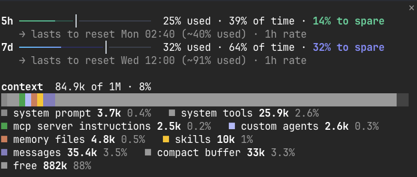
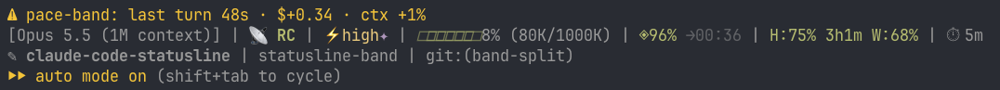

# Pace Band

A [Claude Code mod](https://code.claude.com/docs/en/plugins/mods/): companion to the [pace-statusline](../../README.md) status line. It shows what a status line cannot.

## `/pace`

A pane, opened and closed by `/pace` (`/pace en|ru|auto` sets the language instead, see [Language](#language)):



The same as text:

```
5h ━━━━━━━━┃━━━━━━━━━━━━━━━━━━━━━━━━━━━━  12% used · 72% of time · 60% to spare
   → lasts to reset Sun 00:40 (~19% used) · 1h rate
7d ━━━━━━━━━━━━━━━━━━━━┃━━━━━━━━━━━━━━━━━  19% used · 50% of time · 31% to spare
   → runs out Tue 21:06 (in 2d 21h), 14h 54m before reset · 1h rate

context  95.7k of 1M · 10%
█████████████████████████████████████████
■ system prompt 3.7k 0.4%   ■ messages 46.2k 4.6%   ■ free 871k 87%
```

- **Each limit window against its time.** The bar's fill is the share of the limit used, the `┃` is the share of the window's time gone. `to spare` means the limit is spent slower than its time, by that many percent of the limit; `ahead` means faster.
- **Two palettes per window, by the fact.** In reserve: the 5-hour bar green to cyan, the weekly one blue to violet, and the stretch up to `┃` tinted: that is the reserve. Short: amber or pink up to `┃`, red beyond it: that is the overshoot.
- **The forecast.** At the last hour's rate (`1h rate`), or the window's average when there is no reading 10–90 minutes old (`avg rate`). Quiet when the limit lasts to its reset; amber when it runs out while still in reserve; red when it runs out and is already short.
- **The context by category**, as `/context` counts it, estimated locally.

Readings are kept in the mod's store, shared by every session on the machine: they all spend one account's limits, so the forecast counts all of them.

## The last turn, and the band

**What the last turn cost** is the mod's own status line under the prompt, one quiet line replaced after each turn: `last turn 12s · $+0.42 · ctx +3% · 5h +1`. The limit figure is the account's: other sessions spending at the same time count in it.



Claude Code itself puts the mod's name, with a `⚠`, in front of a mod's status line.

**The band** above the prompt shows only when there is something to act on, and stays away otherwise:
- a `compact` button past 80 % context;
- a limit window that runs out before its reset at this rate: `5h ⇡+12 → out Mon 02:15` in red when it is already spent ahead of its time, `7d 30% to spare → out Mon 22:52` in yellow when it is still in reserve and only the rate is too fast. A window spent ahead of its time that still lasts to its reset gets no band: the status line's `⇡` already says it.

`×` hides the band for the session.

## Language

English or Russian, for `/pace` and the [pace-statusline](../../README.md) line together, independent of the language Claude answers in. `/pace en`, `/pace ru` or `/pace auto` sets it, as does `/config` → `pace-band.language`, the plugin's `language` option: `auto` (the default) follows Claude Code's own `language` setting. The status line reads the same option from `settings.json`; its own `STATUSLINE_LANG=en|ru` still pins the line alone. In Russian the forecast reads `кончится Вт 21:06 (через 2д 21ч), за 14ч 54м до сброса · темп за час`.

## Install

```
/plugin marketplace add tsalkin/claude-code-statusline
/plugin install pace-band@tsalkin
```

Needs Claude Code 2.1.287 or later, in the terminal or the Desktop app's Code tab (mods draw nothing in VS Code, `claude -p` or cloud sessions). Limit windows come with a Claude subscription; on an API key `/pace` shows the context only.

Mods are not sandboxed and run with your permissions. `claude plugin validate` lists every hook and call this one makes. It reads the session's usage figures and writes only its own store; it makes no network requests of its own (the `compact` button runs Claude Code's own compaction).

## Tests

```
cd experiments/statusline-band && claude plugin test
```
